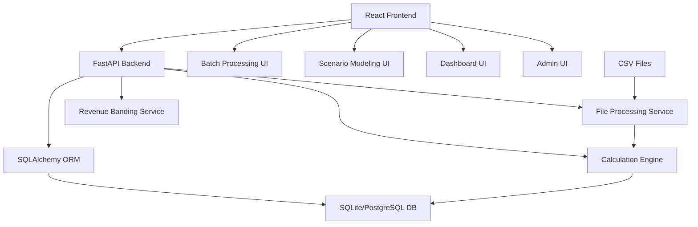
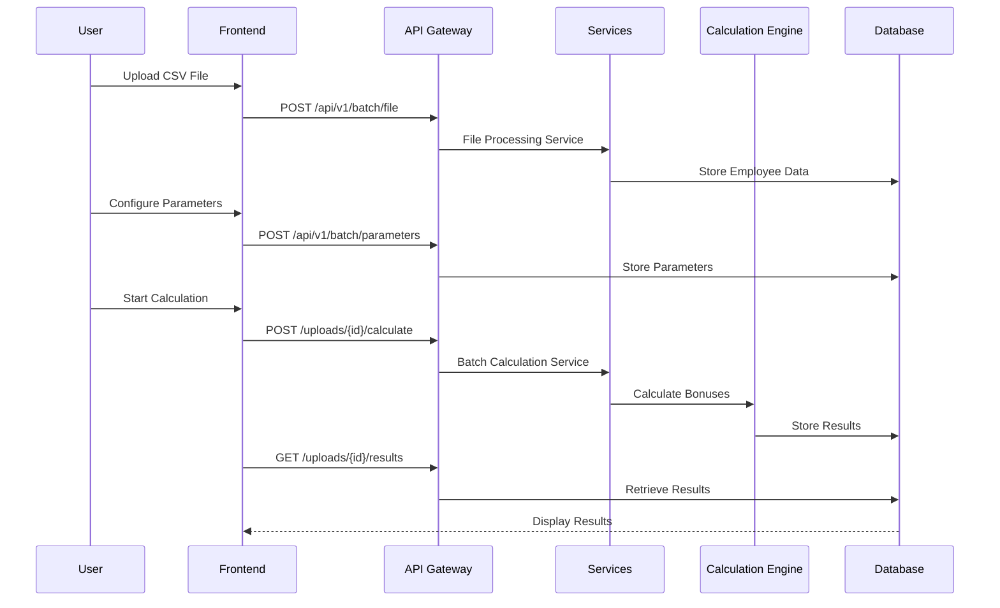

# Bonus Calculator - Codebase Assessment Report

## Executive Summary

**System Overview**: The Bonus Calculator is a comprehensive web application for calculating employee bonuses with batch processing, real-time calculations, and scenario modeling capabilities. It serves HR departments and financial teams who need to compute complex bonus calculations across large employee datasets.

**Core Domains**: 
- Financial calculations with multi-factor bonus algorithms
- Batch CSV processing and data validation
- Scenario modeling and "what-if" analysis
- Revenue-based team performance scoring
- Data analytics and reporting

**Primary Users**: HR professionals, finance teams, managers responsible for compensation planning

**Current State**: Production-ready application with active bug fixes and feature development. Recent commits show focus on resolving batch calculation performance issues.

## Tech Stack & Runtime Matrix

### Backend
- **Language**: Python 3.11+
- **Framework**: FastAPI 0.104.1
- **ORM**: SQLAlchemy 2.0.23 with Alembic 1.13.0 migrations
- **Database**: SQLite (development) / PostgreSQL (production)
- **Validation**: Pydantic 2.5.0
- **Web Server**: Uvicorn 0.24.0
- **Data Processing**: Pandas 2.1.4
- **Testing**: pytest 7.4.3, httpx 0.25.2

### Frontend
- **Language**: TypeScript 5.2.2
- **Framework**: React 18.2.0
- **Build Tool**: Vite 5.0.8
- **Router**: React Router v7.6.0
- **Styling**: Tailwind CSS 3.3.6 + Material-UI 7.1.0
- **State**: React Query 5.17.0
- **Charts**: Recharts 2.15.3
- **Testing**: Vitest 3.1.4, Playwright 1.47.2, Testing Library 16.3.0

### Development Tools
- **Package Managers**: npm (frontend), pip (backend)
- **Code Quality**: ESLint, Prettier, TypeScript
- **Containerization**: Docker Compose
- **Database**: Alembic migrations, SQLite development DB

## Architecture Map

### High-Level Component Architecture


### Data Flow Architecture


## Data & Integrations

### Database Schema Summary
**Core Tables** (8 main entities):
- `sessions` - Anonymous user session management
- `batch_uploads` - File upload tracking
- `employee_data` - CSV import records
- `batch_calculation_results` - Summary results
- `employee_calculation_results` - Individual calculations
- `parameter_presets` - Saved configurations
- `batch_scenarios` - Scenario comparisons
- `revenue_banding` - Team performance data

**Key Relationships**:
- Session → BatchUploads (1:many)
- BatchUpload → EmployeeData (1:many)
- BatchCalculationResult → EmployeeCalculationResults (1:many)

### ORM Usage
- **SQLAlchemy 2.0** with modern async patterns
- **Alembic migrations** for schema versioning
- **Repository pattern** via Data Access Layer (DAL)
- **Connection pooling** and session management

### External Integrations
- **CSV file processing** with pandas and chardet
- **No external APIs** - self-contained system
- **File system storage** for uploads and exports

### Configuration Management
- **Environment variables** via python-dotenv
- **Database connection strings** configurable
- **CORS configuration** for development/production
- **Feature flags** for admin functions

## Control Flow & Key Paths

### Primary User Journeys

**1. Batch Processing Flow**
```
Session Creation → File Upload → Validation → Parameter Config → Calculation → Results → Export
```
- **Entry Point**: `/batch` route
- **Key Components**: BatchUploadContainer, FileUpload, BatchParameterConfig
- **API Endpoints**: `/api/v1/batch/file`, `/uploads/{id}/calculate`
- **Background Processing**: Async calculation with progress tracking

**2. Individual Calculator Flow**
```
Employee Selection → Parameter Input → Real-time Calculation → Results Display
```
- **Entry Point**: `/calculator/{resultId}` route
- **Key Components**: CalculatorContainer, IndividualCalculator
- **Real-time Updates**: Client-side calculation engine

**3. Scenario Modeling Flow**
```
Data Source Selection → Parameter Modification → Comparison → Analysis → Export
```
- **Entry Point**: `/scenarios` route
- **Key Components**: ScenarioPlayground, ScenarioParameterPanel
- **API Endpoints**: `/api/v1/scenarios/*`

### Notable Patterns
- **Session-based anonymous access** (no authentication required)
- **Background task processing** for long-running calculations
- **Client-side calculation mirroring** for real-time feedback
- **Progressive enhancement** with graceful API failure handling

### Anti-Patterns Identified
- **Temporary session workaround** in frontend (commented TODO)
- **Minimal error recovery** in batch processing
- **Limited input validation** on file uploads

## Quality Signals

### Testing Coverage
**Backend Testing**:
- **Unit tests**: calculation_engine, revenue_banding_service, revenue_banding_api
- **Framework**: pytest with asyncio support
- **Coverage**: Limited to core calculation logic

**Frontend Testing**:
- **Unit testing**: Vitest with jsdom
- **Component testing**: React Testing Library
- **E2E testing**: Playwright for admin workflows
- **Coverage**: Basic setup, limited actual tests

### Code Quality Tools
- **Linting**: ESLint for TypeScript/React
- **Formatting**: Prettier for code consistency
- **Type Checking**: TypeScript with strict configuration
- **Backend**: No linting/formatting tools configured

### Complexity Hotspots
**Largest Files by Line Count**:
- `BatchParameterConfig.tsx` (1,339 lines) - Complex parameter management UI
- `IndividualCalculator.tsx` (863 lines) - Feature-rich calculation interface
- `BatchUploadContainer.tsx` (815 lines) - Multi-step upload workflow
- `ScenarioPlayground.tsx` (755 lines) - Scenario modeling interface
- `batch_calculations.py` (605 lines) - Backend calculation orchestration

### Technical Debt Markers
**Limited Technical Debt Found**:
- `backend/app/routers/batch_calculations.py:598` - "TODO: Implement export functionality"
- `frontend/src/App.tsx:23` - "TODO: Re-enable backend session creation once database issues are resolved"

## Security & Reliability

### Authentication/Authorization
- **No authentication system** - anonymous sessions only
- **Session-based access control** with 24-hour expiration
- **Admin features** controlled by environment variables
- **No user management** or role-based access

### Input Validation
- **File upload validation**: Size limits, format checking, encoding detection
- **Parameter validation**: Pydantic schemas for API inputs
- **CSV data validation**: Column validation and data type checking
- **Limited SQL injection protection**: ORM provides basic protection

### Dependency Security
**Backend Dependencies** (relatively current):
- FastAPI, SQLAlchemy, Pydantic - well-maintained, security-focused
- **No obvious vulnerable dependencies** identified
- Python 3.11+ provides security improvements

**Frontend Dependencies**:
- React, TypeScript, Vite - modern, well-maintained stack
- Material-UI, Tailwind - reputable UI libraries
- **Large dependency tree** (~52 dev dependencies)

### Reliability Features
- **Session management** with automatic expiration
- **Data retention service** with automated cleanup
- **Background task processing** with error handling
- **Graceful degradation** on API failures
- **Database transaction management** via SQLAlchemy

### Logging & Monitoring
- **Python logging**: Basic INFO level logging in backend
- **Frontend error handling**: Console logging and user feedback
- **No centralized monitoring** or alerting
- **No performance metrics** collection

## Performance Notes

### Current Performance Issues
Based on recent commits, the system has experienced:
- **Batch calculation hanging** (resolved in recent commits)
- **Progress tracking regression** (100% → 95% reversion)
- **Parameter persistence issues** (critical fix applied)

### Potential Bottlenecks
- **Large file processing**: Pandas-based CSV parsing may be memory-intensive
- **Synchronous calculations**: No parallel processing for batch operations
- **Database queries**: Potential N+1 queries in results display
- **Frontend bundle size**: Large dependency tree may impact load times

### Optimization Opportunities
- **Calculation parallelization**: Background tasks could use worker pools
- **Database indexing**: No explicit indexes on foreign keys
- **Result caching**: No caching layer for repeated calculations
- **Frontend code splitting**: Large components could be lazy-loaded

## Maintenance Risks

### Code Organization
**Strengths**:
- Clear separation of concerns (services, routers, components)
- Consistent naming conventions
- Well-structured component hierarchy

**Risks**:
- **Large component files** (1000+ lines) difficult to maintain
- **Complex parameter management** spread across multiple files
- **Minimal documentation** for business logic

### Ownership & Documentation
- **No clear ownership model** indicated in codebase
- **Limited inline documentation** for complex calculations
- **User guide component** exists but may not cover all features
- **README provides basic setup** but lacks architecture details

### Coupling Issues
- **Tight coupling** between batch processing components
- **Session dependency** propagated through many components  
- **Direct API calls** without consistent error boundary patterns
- **Calculation logic duplication** between client and server

### Hidden Side Effects
- **Background cleanup tasks** may interfere with active sessions
- **Session expiration** not handled gracefully in UI
- **File upload state** not persisted across page refreshes

## Read/Run Guide

### Local Development Setup

#### Prerequisites
- Node.js 18+ and npm
- Python 3.11+
- PostgreSQL (optional, SQLite used by default)

#### Backend Setup
```bash
cd backend
python -m venv venv

# Windows
venv\Scripts\activate
# Linux/Mac  
source venv/bin/activate

pip install -r requirements.txt
python fix_database.py      # Fix any database issues
python update_schema.py     # Update database schema
uvicorn app.main:app --reload
```

#### Frontend Setup
```bash
cd frontend
npm install
npm run dev
```

#### Development Scripts

**Backend (PowerShell)**:
```powershell
# From backend/ directory
.\scripts\migrate_and_seed.ps1  # Run migrations and seed data
.\scripts\test.ps1              # Run backend tests
```

**Frontend**:
```bash
npm run dev     # Development server
npm run build   # Production build
npm run test    # Unit tests
npm test:e2e    # End-to-end tests
npm run lint    # Code linting
```

### Key Development Commands
```bash
# Backend API server (development)
uvicorn app.main:app --reload --host 0.0.0.0 --port 8000

# Frontend development server  
npm run dev  # Runs on http://localhost:3000

# Database operations
python fix_database.py      # Reset/repair database
python update_schema.py     # Apply schema changes
python seed_revenue_banding.py  # Seed example data

# Testing
pytest                      # Backend tests
npm test                    # Frontend tests
npm run test:e2e           # E2E tests
```

### Application URLs
- **Frontend**: http://localhost:3000
- **Backend API**: http://localhost:8000
- **API Documentation**: http://localhost:8000/docs (Swagger UI)
- **Health Check**: http://localhost:8000/health

### Default Admin Access
Navigate to `/admin/revenue-banding` for revenue band configuration. Admin writes can be disabled via `ENABLE_REVENUE_BANDING_ADMIN=false` environment variable.

---

**Report Generated**: January 2025  
**Codebase Version**: Based on commit d62056a (latest fixes for parameter persistence)