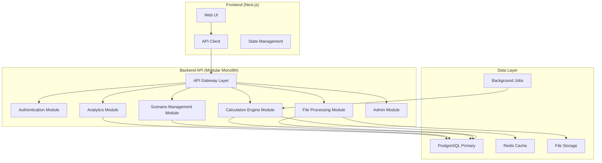

# Bonus Calculator - Greenfield Rewrite Proposal

## Goals & Non-Goals

### Primary Goals
- **Scalability**: Support 10,000+ employee calculations concurrently
- **Reliability**: 99.9% uptime with graceful error handling and recovery
- **Performance**: Sub-3-second response times for batch calculations
- **Maintainability**: Clear architecture boundaries and comprehensive testing
- **Security**: Proper authentication, authorization, and data protection
- **Developer Experience**: Fast local development, clear deployment pipeline

### Non-Goals
- **Multi-tenancy**: Single organization deployment model maintained
- **Real-time collaboration**: No collaborative editing of scenarios
- **Advanced ML**: Keep existing statistical bonus calculation approach
- **Mobile-first**: Desktop web application remains primary target

### Key Constraints Discovered
- **Financial calculation accuracy** must be preserved (banker's rounding, precision)
- **CSV processing workflow** is core to user adoption
- **Anonymous session model** preferred over user authentication
- **Scenario comparison** is a key differentiator requiring preservation
- **Revenue banding complexity** needs dedicated service architecture

## Architecture Choice: Modular Monolith

### Recommended Architecture: **Modular Monolith with Service Boundaries**

**Rationale**:
- **Current complexity** doesn't justify microservices overhead
- **Data consistency** requirements favor single database transactions
- **Team size** (appears to be small) benefits from monolith simplicity
- **Performance** needs favor in-process communication
- **Clear module boundaries** provide future microservice extraction path

### Architecture Diagram


### Module Boundaries
1. **Authentication & Session Management**
2. **File Processing & Validation** 
3. **Calculation Engine & Business Rules**
4. **Scenario Management & Comparison**
5. **Analytics & Reporting**
6. **Administration & Configuration**

## Language/Framework Selection

### Backend: **Python + FastAPI** (Recommended - Continue Current Stack)

**Pros**:
- **Team familiarity** - no learning curve
- **Rich ecosystem** for data processing (pandas, numpy)
- **FastAPI maturity** - excellent async performance
- **Type safety** with Pydantic v2
- **Strong testing ecosystem** (pytest, httpx)

**Cons**:
- **GIL limitations** for CPU-intensive calculations
- **Dependency management** complexity in Python ecosystem

**Alternative Considered**: **TypeScript + Nest.js**
- **Pros**: Single language across stack, excellent TypeScript ecosystem
- **Cons**: Learning curve, potential performance limitations for calculations

### Frontend: **TypeScript + Next.js** (Upgrade from React + Vite)

**Recommended Changes**:
- **Next.js 15** with App Router for better performance and SEO
- **Server-side rendering** for improved initial page loads
- **Built-in API routes** for BFF (Backend for Frontend) pattern
- **Image optimization** and bundle optimization out-of-the-box

**Pros**:
- **Production-ready optimizations** built-in
- **Better developer experience** with integrated tooling
- **Server components** for improved performance
- **API routes** for edge functions and data transformation

**Cons**:
- **Framework lock-in** compared to Vite flexibility
- **Learning curve** for App Router patterns

### Database: **PostgreSQL + Redis** (Upgrade from SQLite)

**Primary Database**: **PostgreSQL 15+**
- **ACID compliance** for financial calculations
- **JSON support** for flexible parameter storage
- **Excellent performance** with proper indexing
- **Backup and recovery** tools

**Cache Layer**: **Redis 7+**
- **Calculation result caching** for repeated scenarios
- **Session management** with TTL
- **Background job queue** (Redis + Celery/RQ)

## Project Layout

### Backend Structure (Python)
```
app/
├── main.py                     # FastAPI application entry
├── config/                     # Configuration management
│   ├── settings.py
│   └── database.py
├── core/                       # Core utilities
│   ├── dependencies.py
│   ├── security.py
│   └── exceptions.py
├── modules/                    # Business modules
│   ├── auth/
│   │   ├── router.py
│   │   ├── service.py
│   │   ├── models.py
│   │   └── schemas.py
│   ├── files/
│   │   ├── router.py
│   │   ├── service.py
│   │   ├── models.py
│   │   ├── schemas.py
│   │   └── processors/
│   ├── calculations/
│   │   ├── router.py
│   │   ├── service.py
│   │   ├── engine.py
│   │   ├── models.py
│   │   └── schemas.py
│   ├── scenarios/
│   ├── analytics/
│   └── admin/
├── shared/                     # Shared utilities
│   ├── database.py
│   ├── cache.py
│   └── storage.py
└── tests/
    ├── unit/
    ├── integration/
    └── fixtures/
```

### Frontend Structure (Next.js)
```
app/                           # App Router directory
├── (dashboard)/               # Route groups
│   ├── analytics/
│   └── reports/
├── batch/
│   ├── upload/
│   ├── [uploadId]/
│   └── results/
├── scenarios/
├── calculator/
├── admin/
└── api/                      # API routes (BFF pattern)
    ├── proxy/                # Backend proxy routes
    └── transforms/           # Data transformation routes

components/                    # Reusable components
├── ui/                       # Base UI components
├── forms/                    # Form components
├── charts/                   # Visualization components
└── features/                 # Feature-specific components
    ├── batch/
    ├── calculations/
    └── scenarios/

lib/                          # Utilities and configs
├── api.ts                    # API client configuration
├── validations.ts            # Zod schemas
├── utils.ts                  # Helper functions
└── constants.ts              # Application constants

hooks/                        # Custom React hooks
├── use-api.ts
├── use-calculations.ts
└── use-sessions.ts
```

## Data Architecture

### Storage Strategy

**Primary Database** (PostgreSQL):
```sql
-- Optimized schema with proper indexing
CREATE TABLE sessions (
    id UUID PRIMARY KEY DEFAULT gen_random_uuid(),
    created_at TIMESTAMP WITH TIME ZONE DEFAULT now(),
    expires_at TIMESTAMP WITH TIME ZONE,
    metadata JSONB
);
CREATE INDEX idx_sessions_expires ON sessions(expires_at);

CREATE TABLE batch_uploads (
    id UUID PRIMARY KEY DEFAULT gen_random_uuid(),
    session_id UUID REFERENCES sessions(id),
    filename VARCHAR(255) NOT NULL,
    status VARCHAR(50) NOT NULL,
    metadata JSONB,
    created_at TIMESTAMP WITH TIME ZONE DEFAULT now()
);
CREATE INDEX idx_batch_uploads_session ON batch_uploads(session_id);
CREATE INDEX idx_batch_uploads_status ON batch_uploads(status);

-- Partitioned table for large datasets
CREATE TABLE employee_calculations (
    id UUID PRIMARY KEY DEFAULT gen_random_uuid(),
    batch_id UUID REFERENCES batch_uploads(id),
    employee_id VARCHAR(100) NOT NULL,
    calculation_data JSONB NOT NULL,
    created_at TIMESTAMP WITH TIME ZONE DEFAULT now()
) PARTITION BY RANGE (created_at);
```

**Caching Strategy** (Redis):
- **L1 Cache**: In-memory calculation results (5 minutes TTL)
- **L2 Cache**: Redis calculation cache (1 hour TTL)
- **Session Cache**: User sessions (24 hours TTL)
- **Parameter Cache**: Frequently used parameter presets (1 day TTL)

### Migration Strategy
- **Alembic** for schema migrations
- **Blue-green deployment** support
- **Backward compatibility** for API changes
- **Data migration scripts** with rollback capability

### Indexing Strategy
```sql
-- Performance indexes
CREATE INDEX idx_employee_calculations_batch_employee 
    ON employee_calculations(batch_id, employee_id);
    
CREATE INDEX idx_calculation_results_performance 
    ON calculation_results USING GIN (calculation_data);
    
-- Partial indexes for active data
CREATE INDEX idx_active_sessions 
    ON sessions(id) WHERE expires_at > now();
```

## API & Contracts

### External API Design

**RESTful API** with consistent response format:
```typescript
// Standard API Response
interface ApiResponse<T> {
  success: boolean;
  data?: T;
  error?: {
    code: string;
    message: string;
    details?: Record<string, any>;
  };
  meta?: {
    pagination?: PaginationMeta;
    timestamp: string;
  };
}

// Calculation Request
interface CalculationRequest {
  uploadId: string;
  parameters: CalculationParameters;
  options?: {
    async?: boolean;
    cacheable?: boolean;
  };
}
```

### API Versioning Strategy
- **URL-based versioning**: `/api/v1/`, `/api/v2/`
- **Header-based feature flags** for gradual rollouts
- **Deprecated endpoint warnings** with sunset dates
- **Backward compatibility** for at least 2 versions

### Internal Module Contracts
```python
# Calculation Engine Interface
from abc import ABC, abstractmethod

class CalculationEngine(ABC):
    @abstractmethod
    async def calculate_batch(
        self, 
        employees: List[EmployeeData], 
        parameters: CalculationParameters
    ) -> BatchCalculationResult:
        pass
    
    @abstractmethod
    async def calculate_individual(
        self,
        employee: EmployeeData,
        parameters: CalculationParameters
    ) -> EmployeeCalculationResult:
        pass
```

## Security & Compliance

### Authentication Strategy
**Recommended**: **Session-based with optional API keys**
- **Anonymous sessions** for trial/demo users (current model)
- **API key authentication** for integrations
- **JWT tokens** for authenticated users (future enhancement)
- **Role-based access control** (Admin, User, ReadOnly)

### Input Validation
```python
# Comprehensive validation with Pydantic v2
from pydantic import BaseModel, Field, validator
from decimal import Decimal

class CalculationParameters(BaseModel):
    base_salary: Decimal = Field(gt=0, max_digits=12, decimal_places=2)
    target_bonus_pct: Decimal = Field(ge=0, le=100, max_digits=5, decimal_places=2)
    investment_score: Decimal = Field(ge=0, le=100, max_digits=5, decimal_places=2)
    
    @validator('base_salary')
    def validate_salary_range(cls, v):
        if v > 10_000_000:  # $10M cap
            raise ValueError('Salary exceeds maximum allowed')
        return v
```

### Data Protection
- **Encryption at rest** for sensitive employee data
- **TLS 1.3** for all communications
- **Field-level encryption** for PII (names, IDs)
- **Data retention policies** with automated cleanup
- **Audit logging** for all calculation operations

### Secrets Management
- **Environment-based configuration** (12-factor app)
- **HashiCorp Vault** or **AWS Secrets Manager** for production
- **Kubernetes secrets** for container deployments
- **Secret rotation** capabilities

## Observability

### Logging Strategy
```python
import structlog

# Structured logging setup
logger = structlog.get_logger(__name__)

# Example usage
logger.info(
    "batch_calculation_started",
    batch_id=batch_id,
    employee_count=len(employees),
    parameters=parameters.dict(),
    user_session=session_id
)
```

### Metrics & Monitoring
**Key Metrics to Track**:
- **Business Metrics**: Calculations per day, average batch size, error rates
- **Performance Metrics**: Response times, database query times, memory usage
- **System Metrics**: CPU usage, disk I/O, network latency
- **Custom Metrics**: Calculation accuracy, parameter usage patterns

**Tools**:
- **Prometheus + Grafana** for metrics and dashboards
- **Jaeger** for distributed tracing
- **Sentry** for error tracking and performance monitoring

### SLOs (Service Level Objectives)
- **Availability**: 99.9% uptime (8.77 hours downtime/year)
- **Latency**: P99 < 5s for batch calculations, P95 < 1s for individual
- **Throughput**: Support 1000 concurrent batch calculations
- **Error Rate**: < 0.1% for calculation errors

### Health Checks
```python
@app.get("/health")
async def health_check():
    return {
        "status": "healthy",
        "version": app_version,
        "checks": {
            "database": await check_database(),
            "redis": await check_redis(),
            "storage": await check_storage()
        }
    }
```

## Testing Strategy

### Test Pyramid
1. **Unit Tests (70%)**:
   - **Calculation engine** logic verification
   - **Business rule** validation
   - **Data transformation** accuracy
   - **Edge case** handling

2. **Integration Tests (20%)**:
   - **API endpoint** testing
   - **Database** integration
   - **File processing** workflows
   - **Cache** behavior

3. **End-to-End Tests (10%)**:
   - **Critical user journeys**
   - **Browser compatibility**
   - **Performance regression** testing

### Testing Tools & Framework
**Backend**:
```python
# pytest with comprehensive fixtures
import pytest
from fastapi.testclient import TestClient
from decimal import Decimal

@pytest.fixture
def sample_employee_data():
    return EmployeeData(
        employee_id="E001",
        base_salary=Decimal("100000.00"),
        target_bonus_pct=Decimal("25.00"),
        # ... other fields
    )

@pytest.mark.asyncio
async def test_bonus_calculation_accuracy(sample_employee_data):
    result = await calculation_engine.calculate_individual(
        sample_employee_data, 
        default_parameters
    )
    assert result.final_bonus == Decimal("25000.00")
```

**Frontend**:
```typescript
// Jest + Testing Library + Mock Service Worker
import { render, screen, waitFor } from '@testing-library/react'
import { rest } from 'msw'
import { server } from '../mocks/server'

test('batch upload calculates bonuses correctly', async () => {
  server.use(
    rest.post('/api/v1/batch/calculate', (req, res, ctx) => {
      return res(ctx.json({ success: true, data: mockResults }))
    })
  )
  
  render(<BatchUploadContainer />)
  // Test implementation
})
```

### Coverage Targets
- **Unit Test Coverage**: 90% minimum
- **Integration Coverage**: 80% of API endpoints
- **E2E Coverage**: All critical user flows
- **Performance Tests**: Load testing for 10x current usage

### CI/CD Testing Gates
1. **Pre-commit hooks**: Linting, formatting, basic tests
2. **PR Requirements**: All tests pass, coverage maintained
3. **Staging Deployment**: Full test suite + smoke tests
4. **Production**: Blue-green with health checks

## Developer Experience

### Local Development Setup
```bash
# Single command development environment
make dev-setup      # Sets up both frontend and backend
make dev-start      # Starts all services with hot reload
make test-all       # Runs full test suite
make clean          # Cleans up development environment
```

### Development Container
```dockerfile
# .devcontainer/Dockerfile
FROM python:3.11-slim as backend
# Backend setup...

FROM node:18-alpine as frontend  
# Frontend setup...

FROM ubuntu:22.04 as development
# Combined development environment
```

### Code Quality Tools
**Backend**:
- **Black** for code formatting
- **isort** for import ordering  
- **mypy** for static type checking
- **ruff** for fast linting
- **pre-commit** hooks for automation

**Frontend**:
- **Prettier** for formatting
- **ESLint** with TypeScript rules
- **Husky** for git hooks
- **lint-staged** for incremental linting

### IDE Integration
```json
// .vscode/settings.json
{
  "python.defaultInterpreter": "./backend/venv/bin/python",
  "python.formatting.provider": "black",
  "typescript.preferences.importModuleSpecifier": "relative",
  "editor.formatOnSave": true
}
```

## Operations

### Deployment Strategy

**Containerized Deployment**:
```yaml
# docker-compose.production.yml
version: '3.8'
services:
  app:
    image: bonus-calculator:latest
    environment:
      - DATABASE_URL=${DATABASE_URL}
      - REDIS_URL=${REDIS_URL}
    healthcheck:
      test: ["CMD", "curl", "-f", "http://localhost:8000/health"]
      interval: 30s
      timeout: 10s
      retries: 3
  
  postgres:
    image: postgres:15-alpine
    volumes:
      - postgres_data:/var/lib/postgresql/data
    environment:
      - POSTGRES_DB=${DB_NAME}
      - POSTGRES_USER=${DB_USER}
      - POSTGRES_PASSWORD=${DB_PASSWORD}
  
  redis:
    image: redis:7-alpine
    volumes:
      - redis_data:/data
```

### Infrastructure as Code
**Terraform** for cloud infrastructure:
```hcl
# main.tf
resource "aws_ecs_cluster" "bonus_calculator" {
  name = "bonus-calculator"
}

resource "aws_ecs_service" "app" {
  name            = "bonus-calculator-app"
  cluster         = aws_ecs_cluster.bonus_calculator.id
  task_definition = aws_ecs_task_definition.app.arn
  desired_count   = 2
  
  load_balancer {
    target_group_arn = aws_lb_target_group.app.arn
    container_name   = "app"
    container_port   = 8000
  }
}
```

### CI/CD Pipeline
```yaml
# .github/workflows/deploy.yml
name: Deploy
on:
  push:
    branches: [main]

jobs:
  test:
    runs-on: ubuntu-latest
    steps:
      - uses: actions/checkout@v4
      - name: Run Tests
        run: |
          make test-all
          make security-scan
  
  deploy:
    needs: test
    runs-on: ubuntu-latest
    steps:
      - name: Deploy to Production
        run: |
          make deploy-production
```

### Monitoring & Alerting
**Key Alerts**:
- **High Error Rate**: > 1% error rate for 5 minutes
- **Slow Response**: P95 latency > 3 seconds
- **Database Issues**: Connection pool exhaustion
- **Memory Usage**: > 80% memory utilization
- **Calculation Accuracy**: Bonus calculation anomalies

### Backup & Recovery
- **Database backups**: Daily full backup, hourly incremental
- **Point-in-time recovery**: 30-day retention
- **File storage backup**: Encrypted backups to cloud storage
- **Disaster recovery**: Cross-region replication
- **RTO/RPO**: 1 hour Recovery Time, 15 minutes Recovery Point

### Scaling Strategy
**Horizontal Scaling**:
- **Stateless application** design for easy scaling
- **Load balancing** with health checks
- **Database read replicas** for reporting queries
- **Background job workers** can scale independently

**Auto-scaling Triggers**:
- CPU utilization > 70%
- Memory utilization > 80%
- Request queue depth > 50

## Risk Register & Trade-offs

### Key Risks & Mitigations

| Risk | Impact | Probability | Mitigation |
|------|---------|-------------|------------|
| **Calculation Accuracy Issues** | High | Medium | Comprehensive test suite, validation, audit logging |
| **Performance Degradation** | Medium | High | Load testing, performance monitoring, caching |
| **Data Loss** | High | Low | Multiple backups, transaction safety, replication |
| **Security Breach** | High | Medium | Security scanning, encryption, access controls |
| **Dependency Vulnerabilities** | Medium | High | Automated security scans, regular updates |
| **Scalability Bottlenecks** | Medium | Medium | Performance testing, horizontal scaling design |

### Architecture Trade-offs

**Monolith vs Microservices**:
- ✅ **Chosen**: Modular Monolith
- **Trade-off**: Simpler deployment vs. independent scaling
- **Rationale**: Team size and complexity don't justify microservices overhead

**Database Choice**:
- ✅ **Chosen**: PostgreSQL
- **Trade-off**: ACID compliance vs. NoSQL flexibility
- **Rationale**: Financial calculations require consistency

**Caching Strategy**:
- ✅ **Chosen**: Redis + In-memory
- **Trade-off**: Complexity vs. Performance
- **Rationale**: Calculation performance is critical

**Frontend Framework**:
- ✅ **Chosen**: Next.js
- **Trade-off**: Framework lock-in vs. Built-in optimizations
- **Rationale**: Production-ready features outweigh flexibility

### Technical Debt Considerations

**Acceptable Debt**:
- **Anonymous session model** - simple but not scalable
- **Single database** - ACID compliance over performance
- **Monolith deployment** - simplicity over independent scaling

**Debt to Avoid**:
- **Large component files** - break into smaller components
- **Tight coupling** - enforce module boundaries
- **Missing tests** - maintain high coverage from start
- **Performance blind spots** - instrument everything

---

**Recommendation Summary**: 
The proposed architecture balances current needs with future growth, emphasizing reliability and maintainability while preserving the core business value of accurate bonus calculations and user-friendly batch processing workflows.